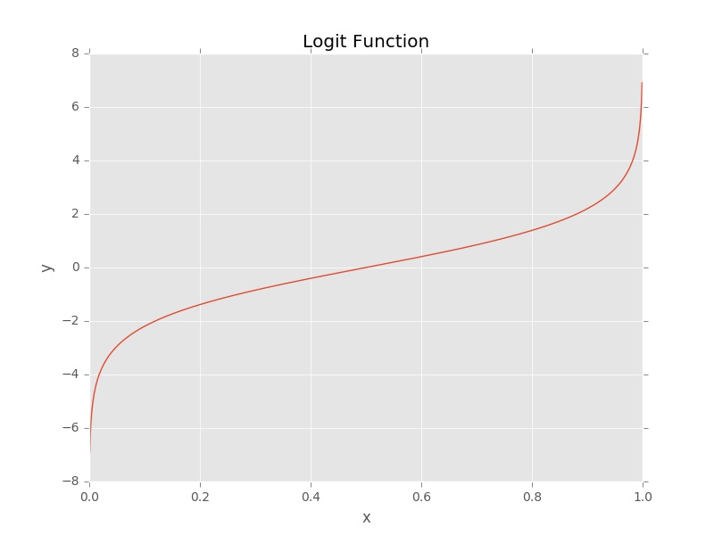
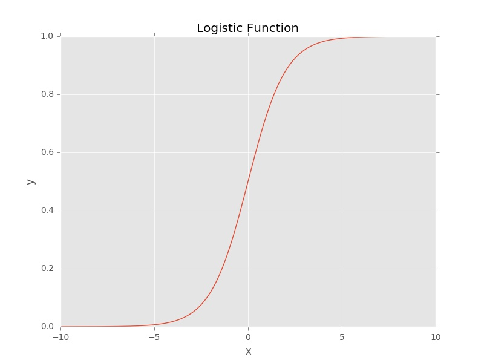
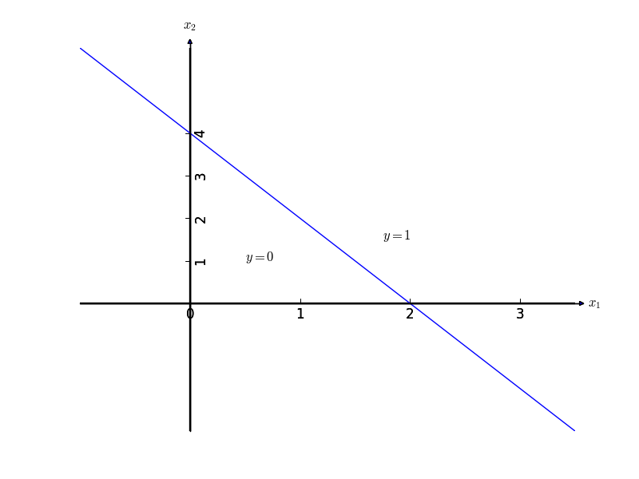
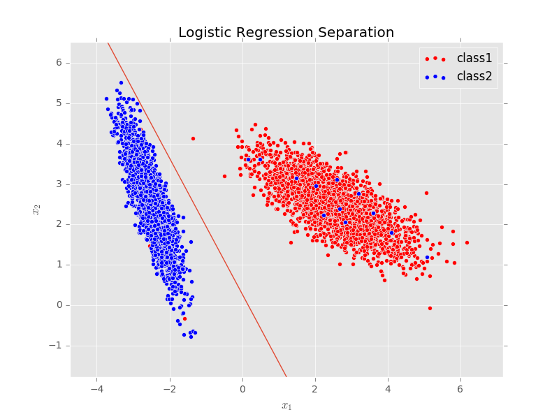

Yet another tutorial on Logistic Regression
#######################################################

:date: 2016-10-22
:author: valilutzik

Logistic regression, is a classification method, that performs well when classes are linearly separable. It is a very simple algorithm, and should be used as a first choice method when starting to model a classification problem. Though, this is not really what really differentiates it from other tools as there are plenty methods that can perform the same exact task.
 
What makes logistic regression attractive is that it belongs to the family of probabilistic models. In many fields, this is important because aside from the fact that we want a linear model with all its interpretability advantages (think linear regression), we want to know how confident we are about assigning each observation to a given class with a certain probability.

For instance a retail bank would want to launch a new product in the market. So maybe the analytics team will try to know beforehand what's the probability given the variables at hand (eg: age, location, salary,...) that each bank's customer will acquire that product. Next, they may discuss/communicate their results in a simple fashion to the marketing department or to their managers to gain more insights or feedback about the collected results. (By the way this is called an “attribution” problem). 

So if a linear regression model follows this structure:

.. math::

	\hat{y}_{reg}= w_0 + w_1x_1 + w_2x_2+ ... + w_nx_n

Where :math:`\hat{y}_{reg}` represents our prediction vector

Which could be rewritten as:

.. math::

	\hat{y}_{reg}= \sum_{j=0}^{n}w_jx_j = \mathbf{w}^{T}\mathbf{x}

Then logistic regression extends it as 

.. math::
	\hat{y}_{logistic} = f( \mathbf{w}^{T}\mathbf{x})

where :math:`f` is a nonlinear function whose form we'll see shortly.

We can see then that the linear equation is transformed using a non-linear function . That’s why it belongs to the  **Generalized linear models** family. And they are called *linear* in the sense that the decision boundary is linear, something to keep in mind as we continue the discussion

Now, if you have already worked with logistic regression before, and you’re confused as I used to be by the different forms it can take:  *logit*, *sigmoid*, *expit*, *logistic*,..., bear with me as things will be clearer soon.

Again in the linear regression setting we have that:

.. math::
	\mu = \mathbb{E}[y|\mathbf{x}] = \mathbf{w}^{T}\mathbf{x}

.. Here is a rapid illustration (taken from []) (maybe choose a different picture?) for the case  of a single variable (with beta as parameters and E[y]):

.. .. figure:: ./images/errors_linreg.jpg
.. 	:alt: The linear model
.. 	:align: center
.. 	:width: 400pt

We could have written the above equation for linear regression as said above:

.. math:: 
	f(\mu) = \mu = \mathbf{w}^{T}\mathbf{x}

Where :math:`f` is the identity function :math:`\mathbb{I}` applied on :math:`\mu`

If we suppose now that the :math:`f` function is the **logit** function:

.. math:: 
	f(\mu) = logit(\mu) = \log(\frac{\mu}{1-\mu}) =  \mathbf{w}^{T}\mathbf{x}

We will change symbols from :math:`\mu` to :math:`\pi` simply to stay consistent with the litterature on the subject.

.. math:: 
	f(\pi) = logit(\pi) = \log(\frac{\pi}{1-\pi}) =  \mathbf{w}^{T}\mathbf{x}

This is the **logistic regression** model with :math:`\pi = P(y=1|\mathbf{x})` representing the probability of *success* 

The ratio :math:`\frac{\pi}{1-\pi}` is called the **odds-ratio** and :math:`log` applied to it is called the **log-odds**

Solving for :math:`\pi`, we obtain the **logistic** or **expit** function:

.. math::
	\pi = logit^{-1}( \mathbf{w}^{T}\mathbf{x}) = \frac{\exp( \mathbf{w}^{T}\mathbf{x})}{1+\exp( \mathbf{w}^{T}\mathbf{x})} = \frac{1}{1+\exp(- \mathbf{w}^{T}\mathbf{x})}

Now what we get now is that the expected value is a proportion, representing the occurence of one of two events. So it is  bounded in the :math:`[0,1]` interval, and could be interpreted therefore as a probability

In this case the logit function is the **link** function and the logistic the **activation** function

The *logit* and its inverse, the *logistic* function are both s-shaped, that’s why they are both commonly referred to as **sigmoid** functions.

So logistic regression is just a generalized form of linear regression where we took linear inputs :math:`\mathbf{xw}` and changed the output domain to :math:`[0,1]` with our function :math:`f`.

You may be wondering now:  *We’re predicting probabilities but I thought logistic regression was a    classification algorithm? What about that linear boundary you were talking about at the beginning?*

Well, to classify our input data with the model, we simply have to choose a threshold value. 

For instance, we can simply state that:

.. math::

	\hat{y}=\left\{\begin{array}{rl} 1 & \mbox{if} \quad \pi > 0.5 \\ 0 & \mbox{Otherwise}\end{array}\right. 

We can choose a different threshold than :math:`0.5` in other situations. But for most purposes this one works well.

For two variables we can get intuition about how things work. Suppose that after optimizing our parameters, we obtained the following best weights vector according to our logistic model:

.. math::
	\mathbf{w} = \begin{bmatrix} 2 \\ 1 \\ -4 \end{bmatrix}

We can predict that :math:`y=1` if:

.. math::
	2x_{1} + x_{2} -4 > 0

Equivalently:

.. math::
	2x_{1} + x_{2} > 4 

We can visualize this easily:

You can see that the decision boundary is what separates the classes. It is linear, implying that if our data points **can't** be separated with a straight line, then it is better to use a more complex classification method, or we could apply non-linear transformations directly into the variables.

For instance if we have only two variables :math:`x_{1}` and :math:`x_{2}` then we could transform them in a polynomial format, like this example:

.. math::
	y = w_{0} + w_{1}x_{1} + w_{2}x_{2}^{2} + w_{3}x_{2}x_{1}

Although we will obtain a complex boundary, this method is not advisable because as the number of the variables grows we will obtain a huge number of combinations in addition to checking each model's accuracy.

So the best practice is to try logisitic regression first and evaluate its performance. If things are not satisfactory, move on to another algorithm.

2 - Parameters/Weights optimization:

Now that we understand how the logistic regression presents itself, the next step is to know how to maximize the parameters :math:`w` so as to fit training data.

And this is the most important part to comprehend in order to have a deeper idea on what your algorithm does when working with real-world datasets.

To learn then the optimal parameters, we will resort to **Maximum Likelihood Estimation**. It is a widely used method, that answers the question: *What are the parameters that will maximize the probability of obtaining my sample data.*

Normally, in practice, you won't get to work with it as you'll mainly keep busy tuning in and monitoring your optimization algorithm (for example gradient descend which we'll see shortly). But it is an important prerequisite in order to understand how logistic regression is trained.

In sum likelihood is proportional to the *probability of observing data given our model*, which we write as :math:`p(D|M)`. Assuming observations are sampled independently we then have:

.. math::
	p(D|M) = \prod_{i=1}^{m} p(\mathbf{x}_i,y_{i})

.. math::
	p(D|M) = \prod_{i=1}^{m} p(y_{i}|\mathbf{x}_i)p(\mathbf{x}_i)

In logistic regression we are interested in learning the **posterior** :math:`p(y_{i}|\mathbf{x}_i)`, so we can leave out the :math:`p(\mathbf{x}_i)` part.

So our likelihood function, which we'll try to maximize and interests us is:

.. math::
	L(\mathbf{w}) = \prod_{i=1}^{m}p(y_i|\mathbf{x}_i;\mathbf{w})

We will now apply the :math:`log` function over it so as to make calculations easier, and take advantage of a nice property of the :math:`logistic` function as we'll see shorty.

So we get the log-likelihood as :

.. math::
	\mathcal{L}_{\mathbf{w}} = \sum_{i=1}^{m} \log p(y_{i}|\mathbf{x}_i;\mathbf{w}) 

And given that our logistic function is modeled as:

.. math::
	\left\{\begin{array}{rl} p(y_i = 1|\mathbf{x}_i) = f(\mathbf{x}_i;\mathbf{w})  \\ p(y_i = 0|\mathbf{x}_i) = 1 - f(\mathbf{x}_i;\mathbf{w}) & \end{array}\right. 

where :math:`f(\mathbf{x};\mathbf{w}) = \frac{1}{1+\exp(-\mathbf{w}^{T}\mathbf{x})}` is our logistic function

We can rewrite it in a short way as:

.. math::
	p(y_i|\mathbf{x}_i) = f(\mathbf{x}_i;\mathbf{w})^{y_i}( 1 - f(\mathbf{x}_i;\mathbf{w}))^{1-y_i} 

You can check each case by replacing :math:`y_i` by its respective value

So we obtain:

.. math::
	\mathcal{L}(\mathbf{w}) = \sum_{i=1}^{m} \log [f(\mathbf{x}_i;w)^{y_{i}}(1-f(\mathbf{x}_i;w))^{1-y_{i}}]

To make things easier, we'll compute the likelihood of sample :math:`i` (having to carry the sums around would be cumbersome)

.. math::
	\mathcal{L}_{i}(\mathbf{w}) = \log [f(\mathbf{x}_i;\mathbf{w})^{y_{i}}(1-f(\mathbf{x}_i;\mathbf{w}))^{1-y_{i}}] = y_{i} \log f(\mathbf{x}_i;\mathbf{w}) + (1-y_{i}) \log (1-f(\mathbf{x}_i;\mathbf{w}))

To find the parameters that maximize maximum likelihood, we typically differentiate the log likelihood with respect to parameters, set the derivatives equal to zero, and solve the resulting equations in a closed form.

Lets try to do that, by taking the gradient of :math:`\mathcal{L}_{i}` with respect to :math:`\mathbf{w}` (the gradient simply means that we are derivating :math:`\mathcal{L}_{i}` along each parameter :math:`j` like this: :math:`\nabla_{\mathbf{w}} \mathcal{L}_{i} = [\frac{\partial \mathcal{L}_{i}}{\partial \mathbf{w}_{1}},...,\frac{\partial \mathcal{L}_{i}}{\partial \mathbf{w}_{j}},...,\frac{\partial \mathcal{L}_{i}}{\partial \mathbf{w}_{n}}]'` where :math:`n` is the number of variables):

.. math ::
	\nabla_{\mathbf{w}} \mathcal{L}_{i}  = \frac{y_{i}}{f(\mathbf{x}_i;\mathbf{w})}\nabla_{\mathbf{w}}f - \frac{1-y_{i}}{1-f(\mathbf{x}_i;\mathbf{w})}\nabla_\mathbf{w}f

.. math ::
	\nabla_{\mathbf{w}} \mathcal{L}_{i} = \frac{y_{i}}{f}f(1-f)\mathbf{x}_i - \frac{1-y_{i}}{1-f}f(1-f)\mathbf{x}_i

Here we used the nice property we talked about earlier of logistic regression (which will be also handy when working with neural networks) where:

.. math::
	\frac{df(x)}{dx} = f(x)(1-f(x))

Going back to our last line:

.. math ::

	\nabla_{\mathbf{w}} \mathcal{L}_{i}   =  \frac{y_{i}}{f}f(1-f)\mathbf{x}_i - \frac{1-y_{i}}{1-f}f(1-f)\mathbf{x}_i 

Simplifiying by :math:`f`:

.. math ::

	\nabla_{\mathbf{w}} \mathcal{L}_{i} =   (y_{i}(1-f) - (1-y_{i})f )\mathbf{x}_i 

We finally get our expression:

.. math ::	
	  \nabla_{\mathbf{w}} \mathcal{L}_{i} =  (y_{i} - f(\mathbf{x}_i;\mathbf{w}))\mathbf{x}_i 
		

For all our samples:

.. math::
	\nabla_{\mathbf{w}}\mathcal{L} = \sum_{i=1}^{m}(y_{i} - f(\mathbf{x}_i;\mathbf{w}))\mathbf{x}_i

The problem now is that we can't solve this directly by setting it to :math:`0` as the group of equations obtained is non-linear in the set of parameters :math:`\mathbf{w}`. We will try to find then the optimal :math:`\mathbf{w}` vector numerically using gradient ascent. This method has the merit of being very simple to comprehend.

Note that here we are trying to maximize the likelihood function, so gradient ascent must be used. But by writing

.. math::
	J(\mathbf{w}) = - \mathcal{L}(\mathbf{w}) 

As :math:`J(\mathbf{w})` representing a **cost function** that we want to minimize, we will resort then to gradient descent.

The steps of batch gradient descent are:

::

	1) Initialize weights with random values
	2) Repeat {
		a) compute the gradient for the entire dataset
		b) use that gradient to update weights vector 
	} Until stopping criteria met

As gradient descent is an iterative method, it has to start somewhere, so in *step 1)* we just initialize parameters to some random values, nothing fancy here.

In *step 2)* we keep repeating actions inside the curly brackets, first as of *2.a)* by computing the gradient for the entire dataset in one pass. In other words:

.. math::
	gradient(J(\mathbf{w})) = \nabla_{\mathbf{w}} J(\mathbf{w}) = - \sum_{i=1}^{m}(y_{i} - f(\mathbf{x}_i;\mathbf{w}))\mathbf{x}_i

This is done for each parameter :math:`\mathbf{w}_{j}` as follows:

.. math::
	 \frac{\partial J(\mathbf{w})}{\partial \mathbf{w}_{j}}=- \sum_{i=1}^{m}(y_{i} - f(\mathbf{x}_i;\mathbf{w}))\mathbf{x}_{ij}

Then update the weights vector in *2.b)* for each parameter :math:`\mathbf{w}_{j}` as follows:

.. math::
	\mathbf{w}_{j+1} \leftarrow \mathbf{w}_{j} + \eta \frac{\partial J(\mathbf{w})}{\partial \mathbf{w}_{j}}

What's really nice about the above update is that weights update is proportional to the error, such that:  :math:`error_{i} = y_i - f(\mathbf{x}_i;\mathbf{w})`. So if our function correctly predicts the class along direction :math:`j` for instance, the weight vector doesn't change in that direction.

Note that the weights vector is computed at once (i.e. the *step 2)* is done directly):

.. math::	
	\mathbf{w}_{new} \leftarrow \mathbf{w}_{old} + \eta \nabla_{\mathbf{w}} J(\mathbf{w})

And we keep iterating till achieving our stopping condition. For example, after a fixed number of iterations (as we'll see in our code below), after achieving a desired error rate or if there is a tiny change in the value of the gradient.

That's all about it! We will code what we learned in Python, to further understand the underlying concepts. But in fact you won't do that normally, as you will resort to a ML library. Scikit-learn has a very nice API that makes coding machine learning very effortless and provides a plethora of options. Furthermore, scikit itself uses in the background very optimized modules. So it is advisable to get acquainted with its excellent documentation.  

3- Practicing what we have learned:

Ok, so now we will apply the theory to 2 datasets.

We'll apply the pure Python implementation on a mock linearly separable dataset so as not to make things complicated. Then we'll move on to a real dataset analyzed with scikit.

In principle we simply have to follow these steps:

::

    a- Preprocess the data
    b- Fit the model to training data
    c- Use the fitted model to predict new data

3.1 - Raw Python:

.. code-block:: python

	import numpy as np 
	from matplotlib import pyplot as plt
	from sklearn.datasets import make_classification

	#Creating the training and test sets
	class_data = make_classification(n_samples = 5000, n_features = 2, n_redundant = 0, class_sep = 2.5, n_clusters_per_class = 1, random_state = 32)
	data= class_data[0]
	target = class_data[1]
	#add intercept
	data = np.append(np.ones((data.shape[0],1)),data,axis=1)

	#Sigmoid function definition. Here we could have used the expit function from scipy.special	
	def sigmoid(X): 
		return 1/(1+np.exp(-X))

	#Function to calculate gradient descent	
	def  gradDescent(data, target, learning_rate = 0.01, maxIter=1000):
		m,n = data.shape
		weights = np.ones((n,1))
		for i in range(maxIter):
			f = sigmoid(np.dot(data,weights))
			error = (target.reshape(-1,1) - f)
			#Below we compute the gradient and update the weights vector as outlined in 2)
			weights = weights + learning_rate *  (np.dot(data.T,error))  
		return weights	

	#Here we plot the boundary in 2D for the first 2 variables (without counting the intercept)	
	def  plot_boundary(weights, data, target):  
		colors = ["red","blue"]
		for i in [0,1]:
			x1 = data[:,1][target == i]
			x2 = data[:,2][target == i]
			plt.scatter(x1,x2, c=colors[i])
		plt.xlim(min(data[:,1]) - 1, max(data[:,1]) + 1)
		plt.ylim(min(data[:,2]) -1 ,max(data[:,2]) + 1)
		x1 = np.arange(min(data[:,1]),max(data[:,1]),0.01)
		x2 = (-weights[0] - weights[1]*x1)/weights[2]
		plt.plot(x1,x2)
		plt.show()	

We start by applying the ``gradDescent()`` function on ``data`` and ``target`` :

.. code-block:: console

	>>>w = gradDescent(data,target)

We obtain the following weights:

.. code-block:: console

	>>>w
	array([[ -1.95945677],
	       [ 11.95310126],
	       [ 7.09669171]])

Moving on to visualizing our separating line:

.. code-block:: console

	>>>plot_boundary(w,data,target)

So the boundary obtained after our choosen number of iterations is:

Our line does a good job at separating data points, although we see visually that it is possible to draw other valid lines. The data is easily separable so even with a small number of iterations we could have a satisfactory result.  You can try to customize further your own dataset, with the more flexible ``make_blobs()`` method.

Finally we can classify new data with a simple function using a threshold of :math:`0.5`.

.. code-block:: python

	#Return the class label according to threshold
	def predict(weights, new_data):
		return np.where(sigmoid(np.dot(new_data, weights)) > 0.5, 2, 1)

We test that with a simple list [issue here!]

.. code-block:: console

	>>>predict(w, [1, 2.33, 1.85])
	array([1])

3.2- Sklearn Implementation

Now we will use scikit with a real dataset

The dataset we will use comes from the UCI repository. This dataset is about a marketing campaign, where given our predictors, we want to know if an existing client will subscribe a term deposit. Full description is available here_. 	

.. _here: https://archive.ics.uci.edu/ml/datasets/Bank+Marketing

.. code-block:: python

	import zipfile
	import StringIO
	import requests
	import pandas as pd
	import numpy as np
	from sklearn.cross_validation import train_test_split
	from sklearn.linear_model import SGDClassifier

	r = requests.get("https://archive.ics.uci.edu/ml/machine-learning-databases/00222/bank.zip")
	z = zipfile.ZipFile(StringIO.StringIO(r.content))
	df = pd.read_csv(z.open("bank.csv"), delimiter=";")

	def data_processing(df):
		data = df._get_numeric_data().values #we will choose only numeric values to leave things simple
		data = np.append(np.ones((data.shape[0],1)),data,axis=1)
		target = pd.Categorical(df.ix[:,-1]).codes
		return data, target

.. code-block:: python
	
	>>> data, target = data_processing(df)

.. code-block:: python

	#Splitting our data to training and test sets, with a test_size of say 0.33
	X_train, X_test, y_train, y_test = train_test_split(data, target, test_size=0.33, random_state=33) 
	#Unfortunately scikit doesn't come with gradient descent applied on logisitic regression, we will use stochastic gradient descent instead
	clf = SGDClassifier(loss="log") 
	#Fitting the model to training data
	clf.fit(X_train,y_train)

Scikit provides a very simple way to score our fitted model in new data, with the help of the ``score()`` method, which simply returns the mean accuracy computed on our test data.

So finally, this applied to our test set data results in a score of:

.. code-block:: console

	>>>clf.score(X_test, y_test)
	0.82439678284182305

4- Conclusion

This is it for today's post. I hope that it is informative. I have omitted the use of stochastic gradient descent, regularization and multi-label classification as this will make this tutorial very long. But I will try to publish eventually a short sequel on those topics with the same general outline as this one. 

		

 

